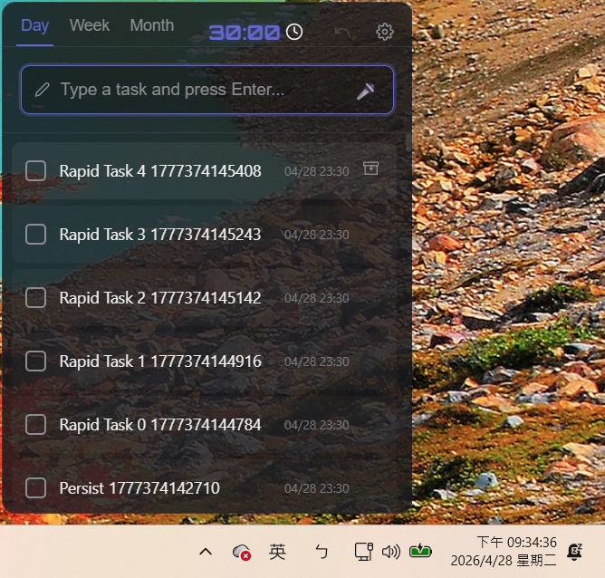

# MenuBar Todo 📝

[](https://electronjs.org)
[](https://opensource.org/licenses/ISC)

**MenuBar Todo** 是一款為重視效率的開發者與專業人士設計的極簡、高效任務管理應用程式。它常駐於您的 Windows 系統匣，讓您能即時捕捉靈感與任務，絕不打斷您的工作流程。

<a href="https://apps.microsoft.com/detail/9P9T972HKHZX?hl=zh-tw&gl=TW&ocid=pdpshare">
  
</a>



---

## ✨ 核心特色

- 🚀 **快速開啟**：透過全域快速鍵 `Ctrl + Shift + Space` 瞬間顯示或隱藏視窗。
- 🎙️ **智慧語音輸入**：
  - 由 **Vosk-WASM** 驅動的完全離線語音識別 —— 無需雲端服務、保障隱私。
  - **即時簡繁轉換**：整合 OpenCC-JS，語音輸入自動將簡體中文轉換為 **繁體中文（台灣標準）**。
- 📅 **直覺化維度分類**：
  - 將任務歸類於 **今天 (Today)、近期 (Incoming)、未來 (Future)** 三大時間桶。
  - **智慧到期日**：自動補正未來期限至最接近的半小時整點（今天 +4h、近期 +7d、未來 +30d）。
- 🎨 **頂級視覺美學**：加大至 420px 寬度的霓虹暗黑介面，搭配毛玻璃特效與全新設計的 **3D 立體抽屜圖示**。
- 🛠️ **進階管理與行內快速編輯**：
  - 專屬的任務管理器，支援即時搜尋與多欄位排序。
  - **行內快速編輯**：直接編輯任務內容、維度（今天/近期/未來）或截止日期。
  - **零點擊日期選擇**：直接輸入、按下鍵盤 `ArrowUp`/`ArrowDown` 或滾動滑鼠滾輪即可輕鬆調整 30 分鐘間隔的到期時間，焦點離開時自動存檔。
- 🍅 **強化版番茄鐘**：
  - 支援自訂精確至 `分:秒` 的完整時間編輯。
  - **自動重設**：番茄鐘結束後若 5 分鐘無操作，自動重設為 25:00 預設狀態。
  - 快速利用滾輪與鍵盤箭頭遞增遞減時間片段，並內建滴答聲與鈴響。
- 📥 **智慧封存與多段復原機制**：
  - **自動封存**：依據時間維度自動整理分類歷史庫。
  - **可逆工作流 (Undo/Redo)**：整合極為完善的全域 Undo/Redo 控制，支援刪除、恢復、狀態切換與維度變更。
- 🔗 **超連結偵測**：自動偵測任務內容中的網址，點擊即可直接以預設瀏覽器開啟。
- 🛡️ **隱私至上**：100% 本地資料儲存。無外部通訊、無用戶追蹤，資料完全屬於您。
- 🌐 **即時同步**：支援多國語系（英文 / 繁體中文），所有獨立視窗狀態皆能即時連動更新。

---

## ⌨️ 快速鍵

| 動作 | 快捷指令 |
| :--- | :--- |
| **顯示 / 隱藏 App** | `Ctrl + Shift + Space` |
| **建立任務** | 輸入框內按 `Enter` |
| **語音輸入** | 點擊 🎤 按鈕（啟動/停止） |
| **取消 / 隱藏** | `Esc` |

---

## 🛠️ 開發與安裝步驟

### 1. 環境要求
請確保您的本機電腦上已安裝 [Node.js](https://nodejs.org/)。

### 2. 安裝與初始化
```bash
git clone https://github.com/mesmerli/MenuBarTodo.git
cd MenuBarTodo
npm install
```

### 3. 離線語音模型配置
下載對應的 Vosk 模型放置於專案的 `models/` 目錄下，接著進行打包：
```bash
# 請將解壓後的模型分別置於 models/en/ 與 models/zh/
npm run pack-models
```

### 4. 開發環境執行
```bash
npm start
```

### 5. 建置發布執行檔
```bash
# 打包並直接運行
npm run dist-run

# 僅產生打包檔 (包含安裝檔與免安裝資料夾)
npm run dist
```

### 6. 自動化 E2E 測試
本專案使用 Playwright 進行強固的單元測試：
```bash
npm test
```

---

## 📦 技術堆疊

- **核心架構**: Electron, Node.js
- **前端呈現**: HTML5, Vanilla CSS, JavaScript
- **離線語音**: Vosk-WASM (完全本地 WebAssembly 支援)
- **驗證測試**: Playwright (33 項 E2E 自動化案例)
- **發布封裝**: Electron Builder

---

## 📜 更新日誌

關於詳細的版本迭代紀錄，請前往參閱 [CHANGELOG.md](CHANGELOG.md)。

---

## 📄 軟體授權

本專案基於 [ISC License](LICENSE) 條款進行發行與維護。

---

**Developed with ❤️ by [mesmerli](https://github.com/mesmerli)**
